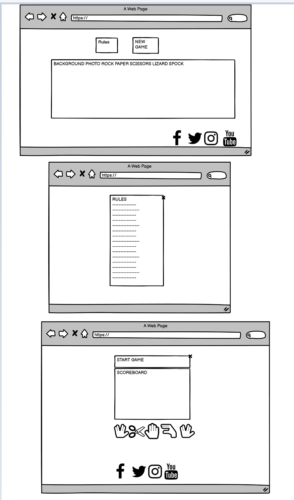
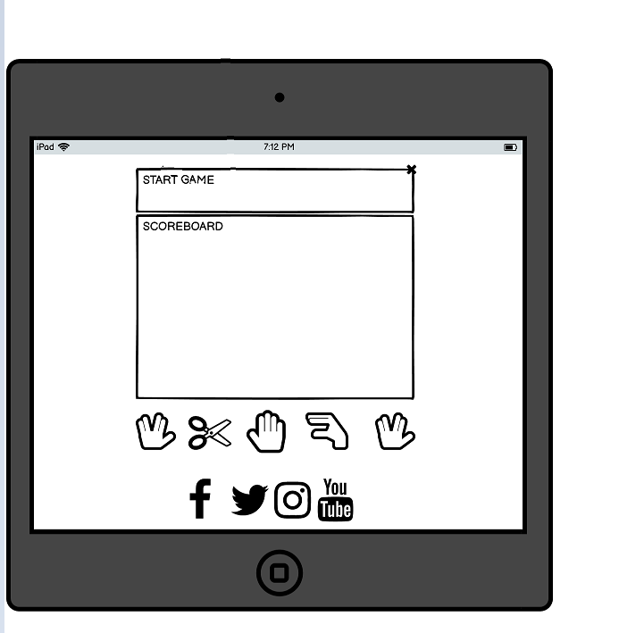
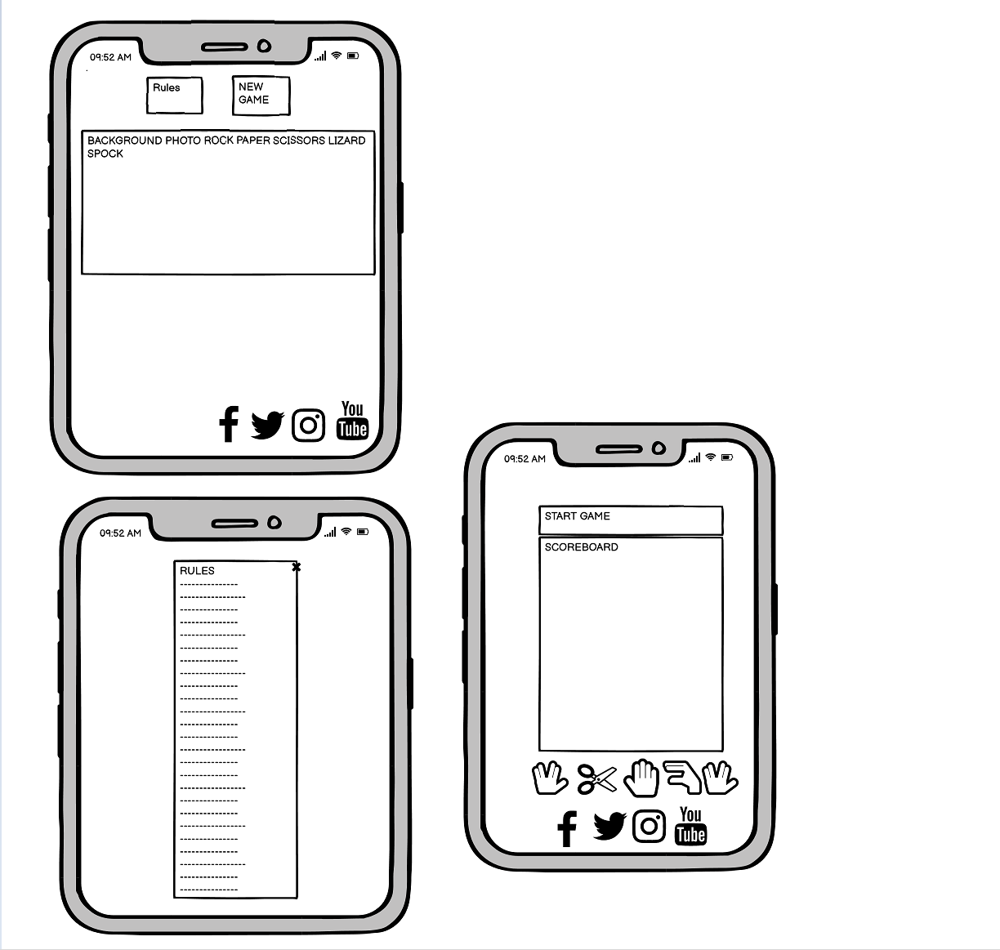
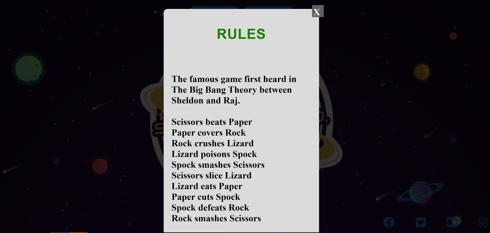

#### MS2 PROJECT 2 - ROCK PAPER SCISSORS LIZARD SPOCK ####

Welcome to my second project. This project is a Rock, Paper, Scissors, Lizard, Spock game that involves languages like HTML5, CSS3 and JavaScript. This game will demonstrate basic JavaScript functionality.

[Here is a link to the final project](https://nikhilkalhan92.github.io/Project-2/)

### AM I RESPONSIVE ###

 ### INITIAL DESIGN ###

 My initial idea was to create a fun interactive game based on a show I used to watch.

- The site needs to be easy to use
- Moving the mouse around the site needs to be simple
- Images that show what the bar looks like inside and the layout 

#### First Time Visitors ####
- The browser must find the game easy to use and play.
- I want the browser to understand how to play the game and the rules

### FINAL DESIGN ###

DESIGN
COLOR SCHEME
My overall color scheme used throughtout the site.

- Crimson Red - 
- Dodger Blue
- Green
- Royal Blue

[Here are my wireframes for desktop, mobile and tablet for this project](assets/wireframes/wireframeproject2.pdf)

#### LANGUAGES USED ####

 
1. HTML5
2. CSS3 
3. JavaScript 

### PROGRAMS USED ###
1. Font Awesome:
Font Awesome was using for a few icons used in the footer aspect of the site pages.

2. Google Fonts:
Google Fonts was used for all the text content on the site pages.

3. GitPod:
GitPod was used to write up the code for my project and using the GitPod terminal to commit everything to GitHub.

4. GitHub:
GitHub is being used to store all the code for this project after being pushed from GitPod.

5. Balsamiq:
Balsamiq was used in the initial design process to make wireframes.

6. Google Chrome Developer Tools:
Firefox Developer Tools was used for trouble shooting and trying new visual changes without it affect the current code already created.

#### DEPLOYMENT ####

I used GitHub pages to deploy my final project. To do this I had to:
1. Login or Sign Up to [GitHub] - https://github.com/nikhilkalhan92/Project-2
2. Create a new repository named "MS2-Project"
3. Once created, click on "Settings" on the navigation bar under the repository title.
4. Choose which folder to deploy from, I used "/root".
5. Click "Save", then wait for it to be deployed. 
6. The URL will be displayed above the "source" section in GitHub Pages.

**HOW TO FORK A REPOSITORY**

If you need to make a copy of a repository:

1. Login or Sign Up to GitHub.
2. On GitHub, go to nikhilkalhan92/Project-2.
3. In the top right corner, click "Fork".

#### TESTING ####
#### CODE VALIDATORS ####

The W3C Markup Validator and W3C CSS Validator was used to validate my project to make sure there were no errors within the site.

1. W3C HTML Validator Results
[HTML](/workspace/Project-2/assets/images/html.png)

2. W3C CSS Validator Results
[CSS](assets/images/csscheck.png)

3. JSHINT Results
[JSS](assets/images/JS.png)

#### WEBSITE TESTING ####

I have tested my site on Safari and google chrome on multiple devices. 
These include:
1. iPhone X
2. iPad Pro
3. Macbook Pro
4. Large Desktop

#### Please find below my testing process for all pages via mobile and web: ####

#### All Pages ####
2. Background - I tested this on Chrome and Safari on all devices.
3. Text: I checked that all text is in the correct and consistent size and font. I also checked that there were no typos.

#### Responsiveness ####
1. I checked that all pages and elements were responsive. Checking each page on mobile and website and adjusting screen size to find breakpoints. It worked as expected.

#### HomePage ####

1. Introduction button - When selecting the "introduction" button, a popup modal appears with a short summary of the game with an embedded video. This worked as expected.
2. Rules button - When selecting the "rules" button, a popup modal appears with rules of the game. This worked as expected.
3. Start game button - When selecting the "start game" button, the browser redirects to the game page. This worked as expected.

#### Footer ####
1. Facebook - When selecting the Facebook icon, a new tab opens and redirects to the Facebook website. It worked as expected.
2. Twitter - When selecting the Twitter icon, a new tab opens and redirects to the Twitter website. It worked as expected.
3. YouTube - When selecting the YouTube icon, a new tab opens and redirects to the YouTube website. It worked as expected.
4. Instagram - When selecting the Instagram icon, a new tab opens and redirects to the Instagram website. It worked as expected.

#### Game Page ####
1. Results - I checked that the result output is displaying the correct caption for the winning / losing outcomes.
2. Scoreboard - I checked that the score board increments the correct score for player and computer.
3. Select your Option - I checked that the icons are all the same size and display the correct colours when hovering over them.
4. Player/Computer choices - I checked that the player button selected appears in the user choice and that the generated computer choice is displaying correctly.
5. Made sure the X button takes you back to the homepage	

#### Google Developer Tools ####

I tested my website using Google Chrome Developer Tools Lighthouse feature, and received the results below:

#### END PRODUCT ####

HOMEPAGE

RULES

GAME

GAME IN ACTION

### IMAGES ###

Link to my background photo is here - https://docs.microsoft.com/en-us/samples/microsoft/rockpaperscissorslizardspock/azure-rock-paper-scissors/

ACKNOWLEDGMENTS

