#### PROJECT 2 - ROCK PAPER SCISSORS LIZARD SPOCK ####

Welcome to my second project. This project is a Rock, Paper, Scissors, Lizard, Spock game involving the programming languages HTML5, CSS3 and JavaScript. This game will demonstrate basic JavaScript functionality.

[Here is a link to the final project](https://nikhilkalhan92.github.io/Project-2/)

### AM I RESPONSIVE ###
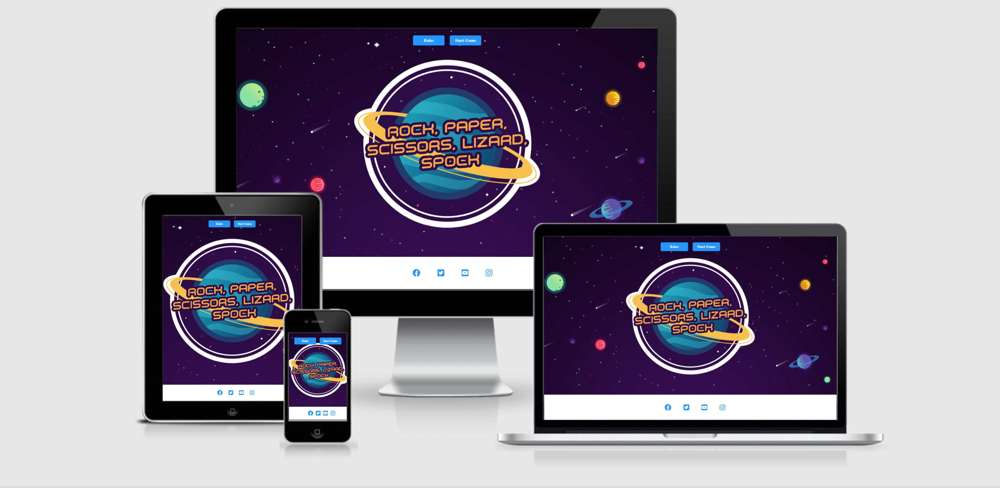

### 1. UX

Everybody knows the basic Rock, Paper, Scissors game, but not everyone knows about the Rock, Paper, Scissors, Lizard, Spock game which originated from the TV show, Big Bang Theory ( Season 2 Episode 8 - "The Lizard-Spock Expansion" ). This game adds 2 extra weapons, Lizard and Spock. This changes the dynamic of the game giving the player/s more variety to win.

## 2. Strategy

### Project Goals

The main goal of this game is to create a fun entertaining game that is interactive to the user and to display the basic use of JavaScript functions. I want the player to be engaged with the game.

 ### User Goals:

First Time Visitor Goals
-   As a first-time visitor, I want to be engaged with the concept of the game.
-   As a first-time visitor, I want to be able to easily understand the rules of the game.
-   As a first-time visitor, I want to play the game to win.

Returning Visitor Goals
-   As a Returning Visitor, I want to beat the computer.

Frequent User Goals
-   As a Frequent User, I want to check to see if we have adjusted the game emojis.

### User Expectations:

The game should be engaging and display a winner and loser.

-   The weapon selection is clear.
-   The user interface is easy to navigate.
-   The game is responsive on all devices including mobile, tablet and desktop.
-   To have the ability to contact the creator of the game.

### Trends of modern games:

-   Mobile gaming 

### 2. - Structure

It is really important to include responsive design in this project as many users are using different devices (mobile, tablet, laptop/PC). This gives the user the best experience on their device.

-   Responsive on all device sizes
-   Easy navigation through labelled buttons
-   Footer at the bottom of the index page that links to the social media website.
-   All elements will be consistent including font size, font family, colour scheme.

### FINAL DESIGN ###

## DESIGN
COLOR SCHEME
My overall color scheme used throughout the site.

- Crimson Red - 
- Dodger Blue
- Green
- Royal Blue
- Hex 

### WIREFRAME ###

I used [Balsamiq](https://balsamiq.com/) to create my wireframes as this gives the template of the UI. This also shows where all elements will be placed within the screen.

There are 3 versions of each wireframe as one shows the design on a web browser and the other shows a Ipad and Iphone

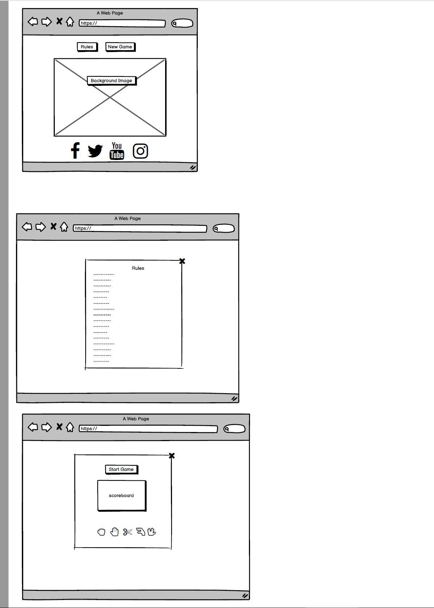
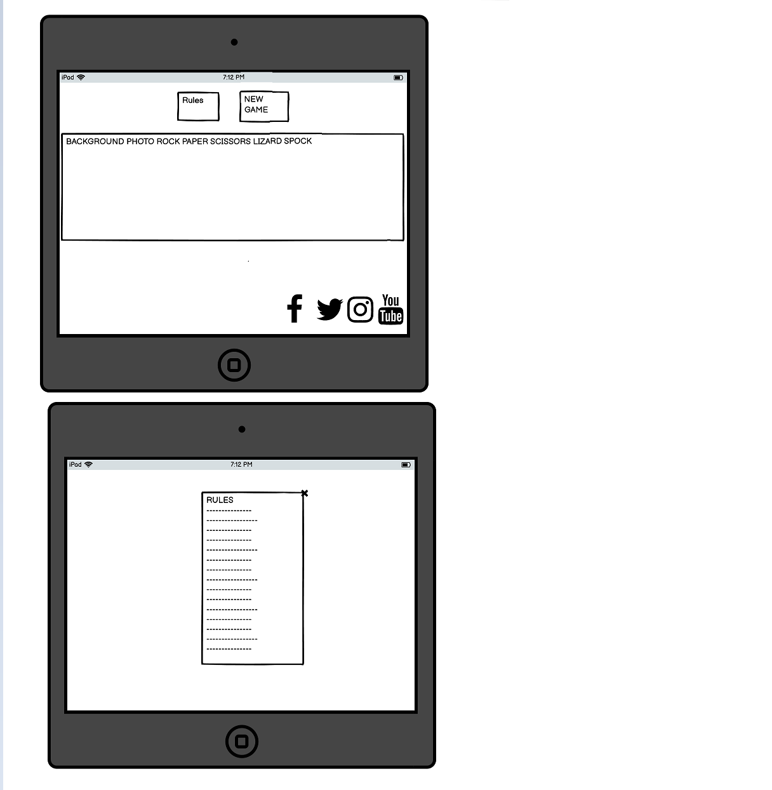
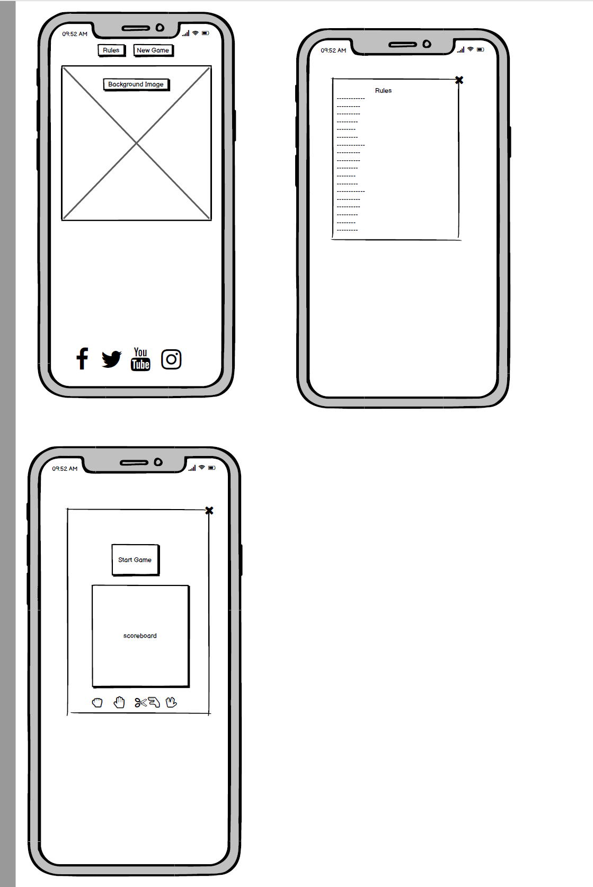

### 3. Features

### Landing Page

- Rules button - This button opens up a popup modal. This modal explains all the rules for the game. Listing the winning possibilities of each weapon. 

- Start game button - This button will allow the user to navigate to the game page.

- Footer - The footer is placed at the bottom of this page. This contains all social media links that open up in a new tab. When hovering over each icon, the icon magnifies.

### Game Page

-   Results - The results section of the page shows the user the outcome of the round.

-   Scoreboard - The scoreboard shows the current score between user and computer. I have color coded the player and computer. So the player will be red, and the computer blue. Once, you start playing, the player presses the emoji they select. Once that happens, the computer option will come up in blue, and the score updates depending on if you win/lose. A sentence will appear telling you the results with the emojis.

-   Select your option - This section allows the player to select their desired weapon. There are 5 icons rock, paper, scissors, lizard, spock. When hovering over each weapon the icon background changes colour to give the user confirmation before selecting the weapon. 

-   Player/Computer choices - This section shows the selection of weapons made by the player and the generated weapon selection for the computer. This uses the same icons as the initial weapon selection part.

-   X option- This button will take the user back to the index page.

- Index Page - if you click out, you will get another pop up modal of start new game or continue the one you are in.

- The game will end and take you to the homepage, showing who won once a player reaches the 2 score.

## 4. Technologies Used

-   [HTML5](https://en.wikipedia.org/wiki/HTML)
    -   The project uses HyperText Markup Language.
-   [CSS3](https://en.wikipedia.org/wiki/CSS)
    -   The project uses Cascading Style Sheets.
-   [JavaScript](https://en.wikipedia.org/wiki/JavaScript)
    -   The project uses JavaScript.
-   [Chrome](https://www.google.com/intl/en_uk/chrome/)
    -   The project uses Chrome to debug and test the source code using HTML5.
-   [Balsamiq](https://balsamiq.com/)
    -   Balsamiq was used to create the wireframes during the design process.
-   [Google Fonts](https://fonts.google.com/)
    -   Google fonts were used to import the "Sans-Serif" font into the style.css file which is used on all pages throughout the project.
-   [GitHub](https://github.com/)
    -   GitHub was used to store the project's code after being pushed from Git.
 
#### DEPLOYMENT ####

I used GitHub pages to deploy my final project. To do this I had to:
1. Login or Sign Up to [GitHub] - https://github.com/nikhilkalhan92/Project-2
2. Create a new repository named "MS2-Project"
3. Once created, click on "Settings" on the navigation bar under the repository title.
4. Choose which folder to deploy from, I used "/root".
5. Click "Save", then wait for it to be deployed. 
6. The URL will be displayed above the "source" section in GitHub Pages.

**HOW TO FORK A REPOSITORY**

If you need to make a copy of a repository:

1. Login or Sign Up to GitHub.
2. On GitHub, go to nikhilkalhan92/Project-2.
3. In the top right corner, click "Fork".

## 5. TESTING

#### CODE VALIDATORS ####

### W3C Validator Tools

1. HTML Validator Results

I used to check for any errors within my HTML pages. I had no errors in the index.

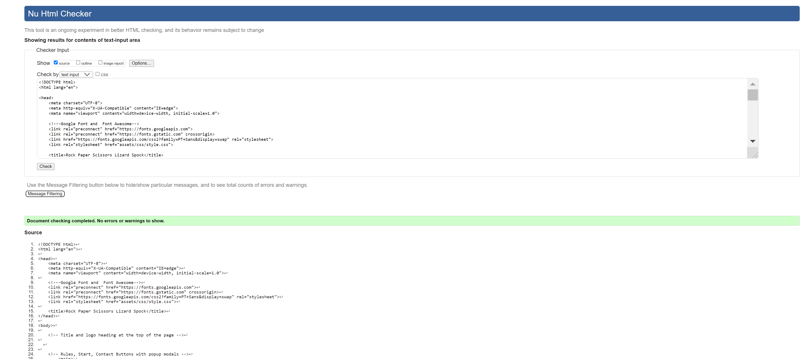

2. W3C CSS Validator Results
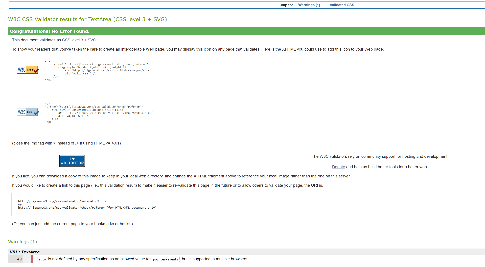

3. JSHINT Results 
   I had a few errors for my javascript, which I managed to resolve quite easily.
   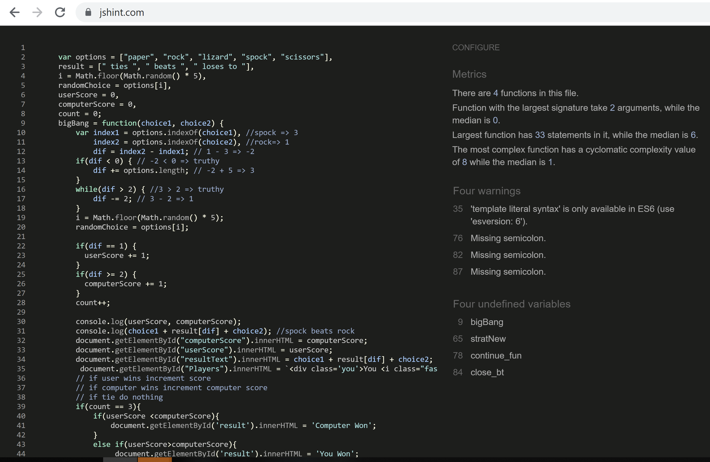 

   JS validator is like this now with no errors
   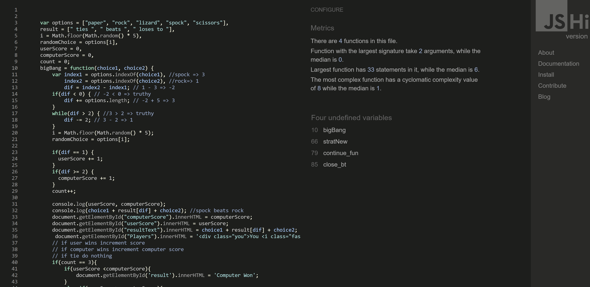

#### WEBSITE TESTING ####

## Manual Testing

I have tested my site on Safari and google chrome on multiple devices.

These include:

-   iPhone X
-   iPhone XS Max
-   iPad Pro
-   Macbook Pro

#### Please find below my testing process for all pages via mobile and web: ####

#### All Pages ####
1. Background - I tested this on Chrome and Safari on all devices.
2. Text: I checked that all text is in the correct and consistent size and font. I also checked that there were no spelling errors.

#### Responsiveness ####
1. I checked that all pages and elements were responsive. To find breakpoints, I adjusted the screen sizes on mobile and website. It worked as expected. 

#### HomePage ####

1. Rules button - When selecting the "rules" button, a popup modal appears with rules of the game. This worked as expected.
2.. Start game button - When selecting the "start game" button, a popup modal appears to the game page. This worked as expected.

#### Footer ####
1. Facebook - When selecting the Facebook icon, a new tab opens and redirects to the Facebook website. It worked as expected.
2. Twitter - When selecting the Twitter icon, a new tab opens and redirects to the Twitter website. It worked as expected.
3. YouTube - When selecting the YouTube icon, a new tab opens and redirects to the YouTube website. It worked as expected.
4. Instagram - When selecting the Instagram icon, a new tab opens and redirects to the Instagram website. It worked as expected.

#### Game Page ####
1. Results - I checked that the result output is displaying the correct caption for the winning / losing outcomes.
2. Scoreboard - I checked that the score board increments the correct score for player and computer.
3. Select your Option - I checked that the icons are all the same size and display the correct colours when hovering over them.
4. Player/Computer choices - I checked that the player button selected appears in the user choice and that the generated computer choice is displaying correctly.
5. Made sure the X button takes you back to the homepage	
6. The game will you if you have beaten the computer or won, once one players get to two.

#### Google Developer Tools ####

I tested my website using Google Chrome Developer Tools Lighthouse feature, and received the results below:

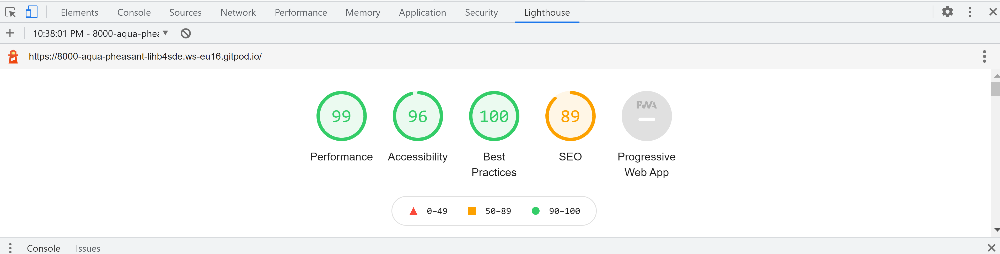

## 6. END PRODUCT 

HOMEPAGE
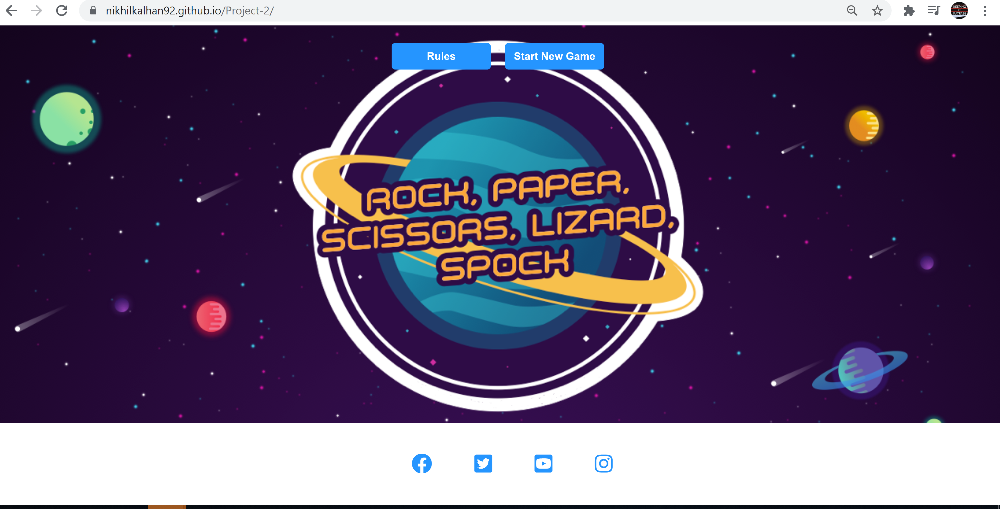

RULES
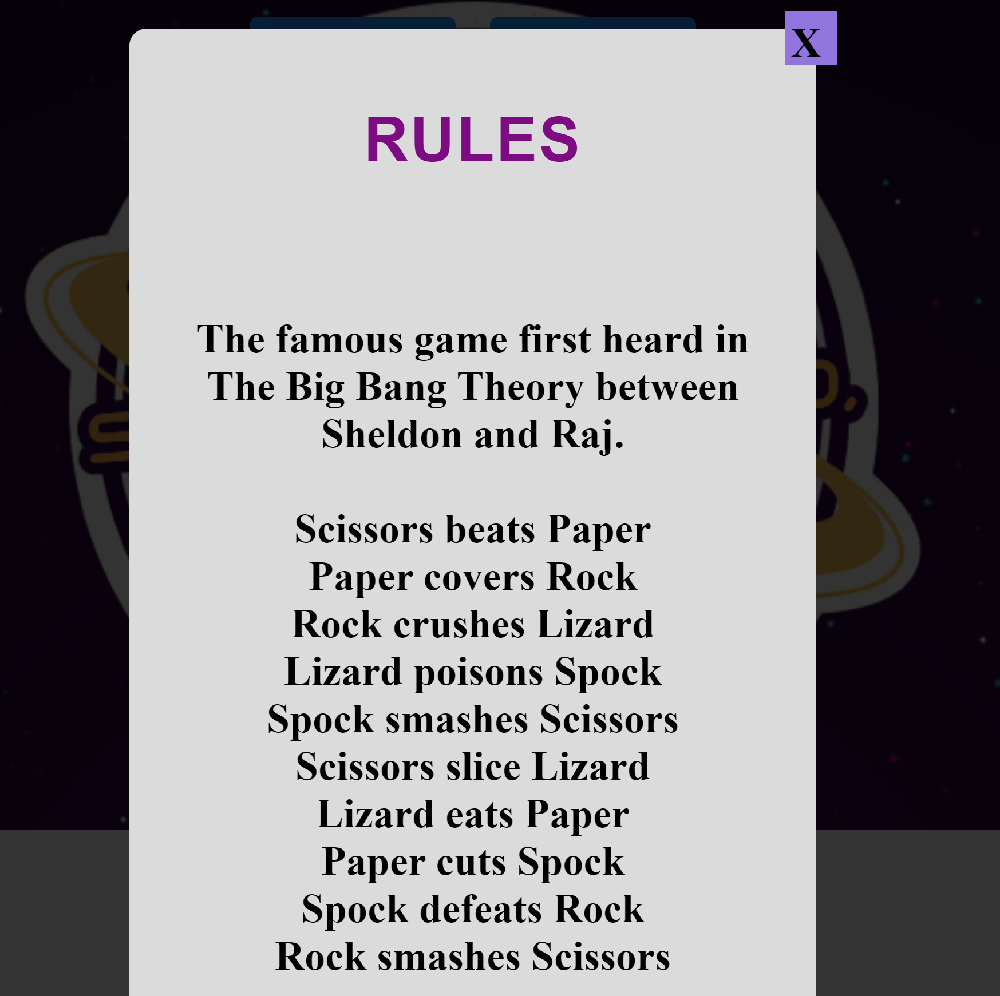

GAME
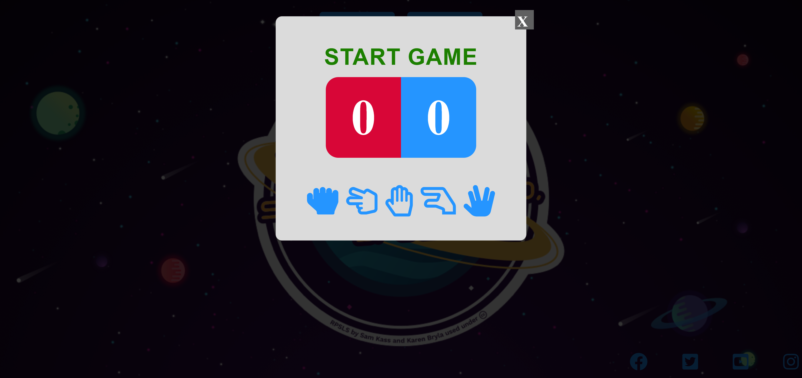

GAME IN ACTION
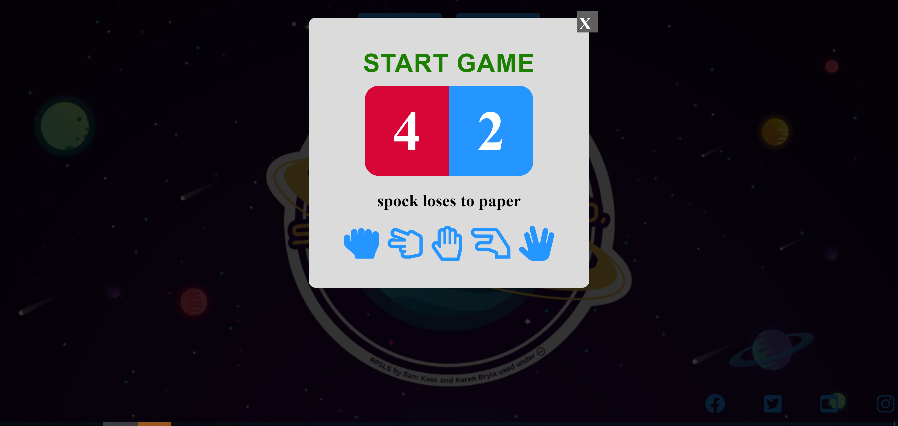

## 7. IMAGES

Link to my background photo is here - https://docs.microsoft.com/en-us/samples/microsoft/rockpaperscissorslizardspock/azure-rock-paper-scissors/

## 8. ACKNOWLEDGMENTS  

Thank you to my mentor Marcel for the help and guidance.

